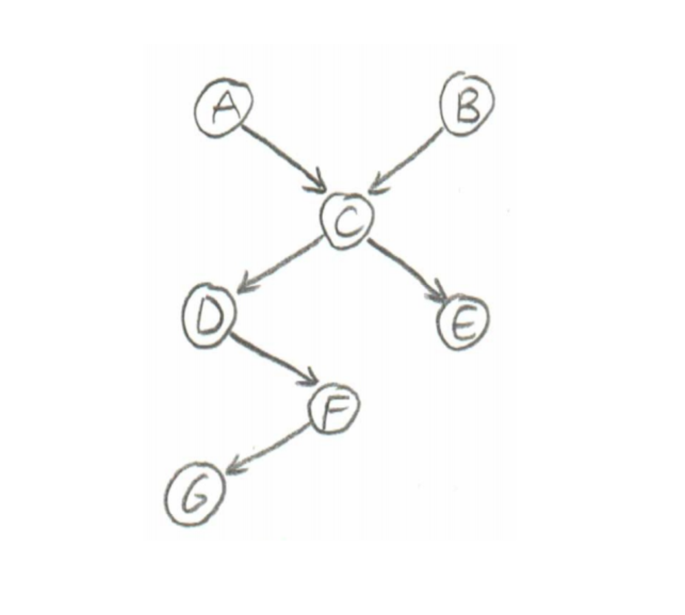
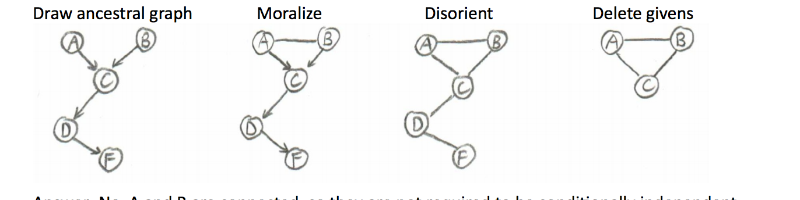

#6.034 Exam 4 Cheat Sheet

\newcommand \ci {\perp\!\!\!\perp}

##Adaboost

###Overview
Take imperfect (weak) classifiers $h_i$ to create a strong overall classifier:

$$
  H(\vec{x}) = \text{SIGN}(\underbrace{\alpha_1}_{\text{voting power}} \cdot h_1(\vec{x}) + \alpha_2 \cdot h_2(\vec{x}) + \ldots)
$$

Each weak classifier $h_i$ has an error rate, $\epsilon$, where $0 \leq \epsilon \leq 1$

Error rate $\epsilon = \sum w_i$

\

Note: after selecting a weak classifier $h_i$, the points that were incorrectly classified by $h_i$ have their $w_i$ increase, while the points that were correctly classified by $h_i$ have their $w_i$ decrease

We build $H(\vec{x})$ in a series of rounds, each round:

  - pick the best* $h_i$
  - calculate voting power $\alpha_i$
  - append $h_i$ to overall classifier, $H$

\* best can mean two different things:

  - smallest $\epsilon$ value
  - $\epsilon$ value furthest away from $\frac{1}{2}$

###Steps

0. Initialize $w_i = \frac{1}{N}$ (assign equal weight to each training points)

1.  Find best* h w/ lowest error rate

2.  Calculate voting power: $\alpha = \frac{1}{2}\ln{\frac{1-\epsilon}{\epsilon}}$

3. Check to see if we're finished:
     - H is good enough (perfectly classifies all of the training data)
     - no good weak classifiers left (i.e. best $h_i$ has $\epsilon_i = \frac{1}{2}$ - no better than a coin-flip )
     - have performed enough rounds of Adaboost

 4. Update Weights:

 $$
 w_\text{NEW} =
 \begin{cases}
  \frac{1}{2} \times \frac{1}{1 - \epsilon} \times w_\text{OLD} & \mbox{if }  w_\text{OLD} \text{ was correctly classified by newly selected } h_i \\
  \frac{1}{2} \times \frac{1}{\epsilon} \times w_\text{OLD} & \mbox{if }  w_\text{OLD} \text{ was incorrectly classified by newly selected } h_i
 \end{cases}
 $$

###(Somewhat) Random Helpful Facts

- If you have $3+$ weak classifiers that make non-overlapping errors, you can make a perfect classifier

    - can't make a perfect classifier with less than $3$

- Only after Round 1:
$\sum_{\text{right}} w_i = \sum_{\text{wrong}}  w_i = \frac{1}{2}$

- At any point: $0 < w_i \leq \frac{1}{2}$
    - notably: $w_i$ can never be $0$

- At any point: $\sum w_i = 1$

- $w_i$ __must__ change every round, since we aren't selecting classifiers with $\epsilon_i = \frac{1}{2}$

- After selecting $h_i$, on the following round: $\mathcal{E}(h_i) = \frac{1}{2}$

- Say we have two classifiers: $h_1$ and $h_2$, and our criteria for selecting the best classifier on any given round is choosing the one with the lowest overall $\epsilon_i$. If $h_1$ misclassifies points $A,B$ and $h_2$ misclassifies $A,B,C$, then $h_2$ will __never__ be selected. $h_2$ has the superset of $h_1$'s errors.

    - If the "best" criteria is the furthest $\epsilon_i$ from $\frac{1}{2}$ instead, then $h_2$ could be chosen.

- Adaboost tends __not__ to overfit

##Bayes Nets

###Probability

####Exhaustion

If var $A$ has $3$ values:
$$
P(A = a_1) + P(A = a_2) + P(A = a_3) =1
$$

$$
P(A = a_1 \mid B = b_1) + P(A = a_2 \mid B = b_1) + P(A = a_3 \mid B = b_1) =1
$$

If $A$ is a boolean value:

$$
P(A = T) + P(A = F) = 1
$$

$$
P(A) + P(\bar{A}) = 1
$$

####Conditionally Probability

$$
P(A \mid B) = \frac{P(AB)}{P(B)}
$$

####Independence

$$
A \ci B \iff P(A \mid B) = P(A)
$$

$$
P(A \mid B) = P(A \mid B)P(B) = P(A)P(B)
$$

Conditional Independence:
$$
A \ci B\mid C \iff P(A \mid BC) = P(A\mid C)
$$

####Chain Rule

$$
P(x_1, \ldots, x_n) = \prod_{i =0}^n P(x_i \mid x_{i+1}\dots x_n)
$$

Ex:

$$
P(AB) = P(A \mid B)P(B)
$$

$$
P(ABC) = P(A \mid BC)P(B \mid C)P(C)
$$

####Bayes Rule

$$
P(A\mid B) = \frac{P(A)P(B \mid A)}{P(B)}
$$

####Prior and Posterior

__Prior Probability__: $P(A)$ - probability of a variable with no evidence

__Posterior Probability__: $P(A \mid E)$ - probability of a variable given some evidence

###Number of Parameters

__2 Boolean Variables__:

- no independence assumption: $2^2 -1 = 3$

- w/ independence assumption: 2, just need $P(A), P(B)$

__100 Boolean Variables__:

- no independence assumption: $2^100 -1$

- w/ independence assumption: 100, just need $P(A), P(B), \ldots$

###Bayes Net Assumption

All variables are conditionally independent of their non-descendeants, given their parents

\

So, using the above net:

$$
F \ci \text{non-descendants}(F) \mid \text{parents}(F)
$$

$$
P(F\mid ABCDE)
$$

$$
P(F\mid \not{A}\not{B}\not{C}D\not{E}) = P(F\mid D)
$$

###D-Separation

We start with an independence question in one of these forms:
-  “Are $A$ and $B$ conditionally independent, given {givens}?”
- “Are $A$ and $B$ marginally independent?”

For instance, if we’re asked to figure out: $P(A\mid BDF) \stackrel{?}{=} P(A\mid DF)$, we can convert it into an
independence question like this: “Are A and B independent, given D and F?”

####Steps

1. Draw ancestral graph
    - Construct the “ancestral graph” of all variables mentioned in the probability expression. This is a reduced version of the original net, consisting only of the variables mentioned and all of their ancestors (parents, parents’ parents, etc.)

2. “Moralize” the ancestral graph by “marrying” the parents.
    - For each pair of variables with a common child, draw an undirected edge (line) between them.
(If a variable has more than two parents, draw lines between every pair of parents.)

3. "Disorient" the graph by replacing the directed edges (arrows) with undirected edges (lines).

4. Delete the givens and their edges.
If the independence question had any given variables, erase those variables from the graph and erase all of their connections, too. Note that “given variables” as used here refers to the question “Are $A$ and $B$ conditionally independent, given $D$ and $F$?”, __not__ the equation: $P(A \mid BDF)
\stackrel{?}{=} P(A \mid DF)$, and thus does not include $B$.

5. Read the answer off the graph.
    - If the variables are disconnected in this graph, they are guaranteed to be independent.
    - If the variables are connected in this graph, they are not guaranteed to be independent.* Note that “are connected” means “have a path between them,” so if we have a path X-Y-Z, X and Z are considered to be connected, even if there’s no edge between them.
    - If one or both of the variables are missing (because they were givens, and were therefore deleted), they are independent.

\* We can say “the variables are dependent, as far as the Bayes net is concerned” or “the Bayes
net does not require the variables to be independent,” but we cannot guarantee dependency
using d-separation alone, because the variables can still be numerically independent (e.g. if
$P(A \mid B)$ and $P(A)$ happen to be equal for all values of $A$ and $B$).

#### "Explaining Away"

Suppose $A$ and $B$ are two people who have a child $C$.  

$A$ and $B$ are unrelated people, so whether either of them has some trait -- such as blue eyes -- is independent.  Let's say that having blue eyes is rare.

Regardless of what we know about $B$, $A$ has blue eyes with some low probability, say $5$%.  

But if we then find out that their child $C$ has blue eyes, $A$ and $B$ are no longer independent.

Now, if we know that $B$ has blue eyes and $C$ has blue eyes, $B$'s having blue eyes "explains away" $C$'s having blue eyes, making it less likely that $A$ has blue eyes (say, $1$% probability).  

This is also known as Berkson's Paradox: If $A$, $B$, and $C$ are unlikely events, and $C$ is dependent on $A$ and $B$, then $P(A \mid BC) < P(A \mid C)$.

###Naive Bayes Classification

__Assumption__: Features $(X_1, X_2, X_3)$ are conditionally independent of each other given classification $Y$.

To classify a point with features: $X_1 = a, X_2 = b, X_3 = c$

Want:

$$
\underbrace{P(Y = y_i \mid X_1 = a, X_2 = b, X_3 = c)}_{\text{posterior probability}}
$$

Via Bayes Rule:
$$
P(Y = y_i \mid X_1 = a, X_2 = b, X_3 = c) = \frac{P(X_1 = a, X_2 = b, X_3 = c \mid Y = y_i)\overbrace{P(Y=y_i)}^{\text{prior probability}}}{P(X_1 = a, X_2 = b, X_3 = c)}
$$

Note (also applying independence assumption here):

$$
P(Y = y_i \mid X_1 = a, X_2 = b, X_3 = c) \propto P(X_1 = a \mid Y = y_i) P( X_2 = b \mid Y = y_i) P( X_3 = c \mid Y = y_i)P(Y=y_i)
$$

And so you want to compare all the classifications, and take the largest probability

###Model Selection

Given several models, $M_i$, that could explain data (evidence), you want to pick the $M_i$ that maximizes:

(Can also apply independence assumption here)

$$
P(M_i \mid \text{data}) = \frac{P(\text{data} \mid M_i)P(M_i)}{P(\text{data})}
$$

Note:

$$
P(M_i \mid \text{data}) \propto P(\text{data} \mid M_i)P(M_i)
$$
